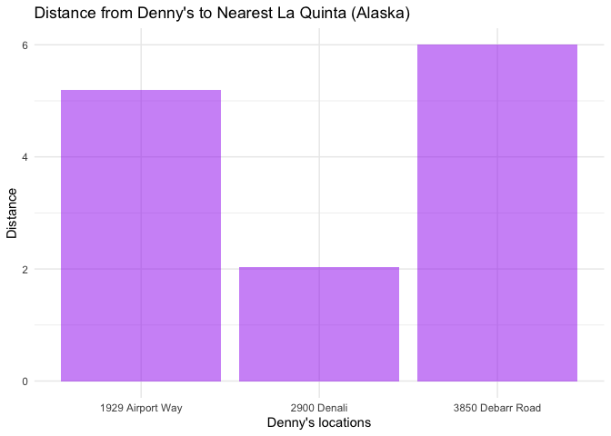
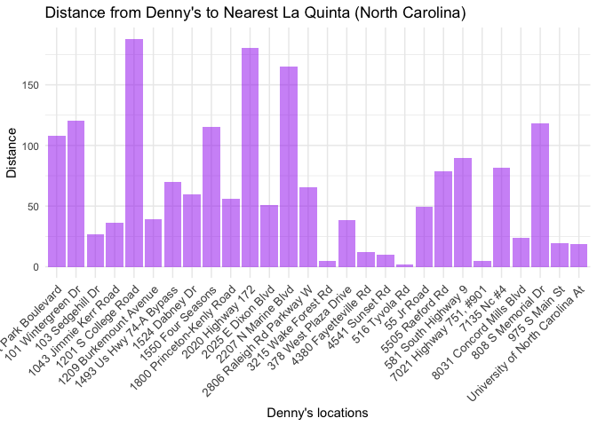
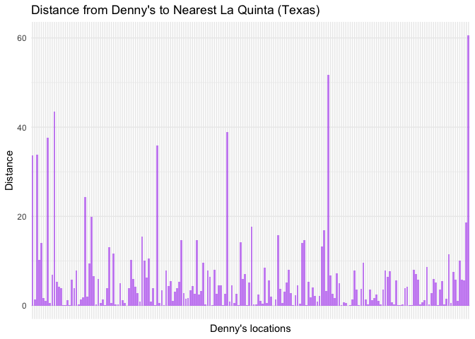
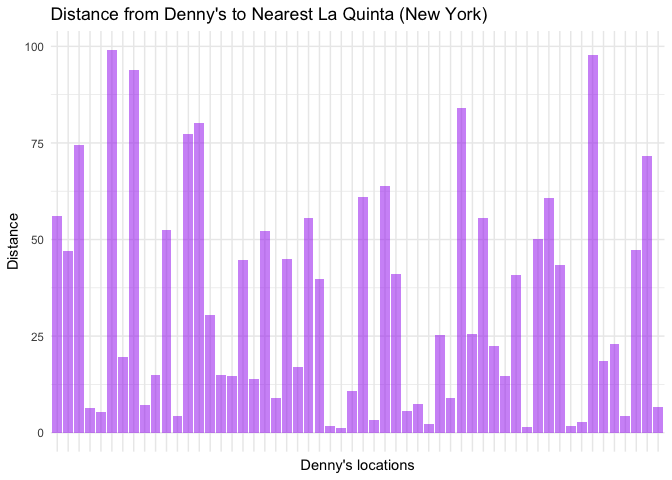

Lab 05 - Wrangling spatial data
================
Cynthia Jiao
Insert date here

### Load packages and data

``` r
library(tidyverse) 
library(dsbox) 
```

``` r
states <- read_csv("data/states.csv")
```

### Exercise 1 & 2

``` r
## filtering out all Dennys and La quinta in AK

dn_ak <- dennys %>%
  filter(state == "AK")
nrow(dn_ak)
```

    ## [1] 3

``` r
lq_ak <- laquinta %>%
  filter(state == "AK")
nrow(lq_ak)
```

    ## [1] 2

``` r
print(nrow(dn_ak)*nrow(lq_ak))
```

    ## [1] 6

There are 3 Denny’s and 2 La quinta in Alaska. And there are 6
combinations of distance that we need to calculate.

### Exercise 3 & 4

``` r
## combing two AK dataset

dn_lq_ak <- full_join(dn_ak, lq_ak, 
                      by = "state")
```

    ## Warning in full_join(dn_ak, lq_ak, by = "state"): Detected an unexpected many-to-many relationship between `x` and `y`.
    ## ℹ Row 1 of `x` matches multiple rows in `y`.
    ## ℹ Row 1 of `y` matches multiple rows in `x`.
    ## ℹ If a many-to-many relationship is expected, set `relationship =
    ##   "many-to-many"` to silence this warning.

``` r
print(dn_lq_ak)
```

    ## # A tibble: 6 × 11
    ##   address.x     city.x state zip.x longitude.x latitude.x address.y city.y zip.y
    ##   <chr>         <chr>  <chr> <chr>       <dbl>      <dbl> <chr>     <chr>  <chr>
    ## 1 2900 Denali   Ancho… AK    99503       -150.       61.2 3501 Min… "\nAn… 99503
    ## 2 2900 Denali   Ancho… AK    99503       -150.       61.2 4920 Dal… "\nFa… 99709
    ## 3 3850 Debarr … Ancho… AK    99508       -150.       61.2 3501 Min… "\nAn… 99503
    ## 4 3850 Debarr … Ancho… AK    99508       -150.       61.2 4920 Dal… "\nFa… 99709
    ## 5 1929 Airport… Fairb… AK    99701       -148.       64.8 3501 Min… "\nAn… 99503
    ## 6 1929 Airport… Fairb… AK    99701       -148.       64.8 4920 Dal… "\nFa… 99709
    ## # ℹ 2 more variables: longitude.y <dbl>, latitude.y <dbl>

There are 6 observations in the new data frame. There are 13 variables
as the two original dataset were joined by “state.” All rest variables
are doubled and marked as .x or .y.

### Exercise 5

``` r
## creating the Haversine function

haversine <- function(long1, lat1, long2, lat2, round = 3) {
  # convert to radians
  long1 <- long1 * pi / 180
  lat1 <- lat1 * pi / 180
  long2 <- long2 * pi / 180
  lat2 <- lat2 * pi / 180

  R <- 6371 # Earth mean radius in km

  a <- sin((lat2 - lat1) / 2)^2 + cos(lat1) * cos(lat2) * sin((long2 - long1) / 2)^2
  d <- R * 2 * asin(sqrt(a))

  return(round(d, round)) # distance in km
}
```

### Exercise 6

``` r
## using Haversine function to calculate distances

dn_lq_ak <- dn_lq_ak %>%
  mutate(distance = haversine(longitude.x, latitude.x, longitude.y, latitude.y, round = 3))
```

### Exercise 7

``` r
## calculate the minimum distance between a Denny’s and La Quinta for each Denny’s location

dn_lq_ak_mindist <- dn_lq_ak %>%
  group_by(address.x) %>%
  summarize(closest = min(distance))

print(dn_lq_ak_mindist)
```

    ## # A tibble: 3 × 2
    ##   address.x        closest
    ##   <chr>              <dbl>
    ## 1 1929 Airport Way    5.20
    ## 2 2900 Denali         2.04
    ## 3 3850 Debarr Road    6.00

### Exercise 8

There are 3 Denny’s locations in Alaska that are nearest to a La quinta
location. Out of the 6 locations, 3 Denny’s locations in Alaska have a
nearby La Quinta within a relatively short distance (under 7 km),
indicating that these two chains tend to be co-located in urban areas.
However, with only three data points, it’s difficult to generalize
broader patterns. Out of 3 nearest locations, min distance = 2.04, max
distance = 6, mean distance = 4.41, median distance = 5.2, sd = 2.09

``` r
## bar plot for the distance between Denny's to Nearest La Quinta for the 3 locations in Alaska.

ggplot(dn_lq_ak_mindist, aes(x = address.x, y = closest)) +
  geom_bar(stat = "identity", fill = "purple", alpha = 0.5) +
  labs(title = "Distance from Denny's to Nearest La Quinta (Alaska)",
       x = "Denny's locations",
       y = "Distance") +
  theme_minimal()
```

<!-- -->

``` r
## summary stats 

summary_stats_ak <- dn_lq_ak_mindist %>%
  summarize(
    mean_distance = mean(closest),
    median_distance = median(closest),
    sd_distance = sd(closest),
    min_distance = min(closest),
    max_distance = max(closest),
    iqr_distance = IQR(closest)
  )

print(summary_stats_ak)
```

    ## # A tibble: 1 × 6
    ##   mean_distance median_distance sd_distance min_distance max_distance
    ##           <dbl>           <dbl>       <dbl>        <dbl>        <dbl>
    ## 1          4.41            5.20        2.10         2.04         6.00
    ## # ℹ 1 more variable: iqr_distance <dbl>

### Exercise 9

Repeat the same analysis for North Carolina

``` r
## filtering out all Dennys and La quinta in NC

dn_nc <- dennys %>%
  filter(state == "NC")
nrow(dn_nc)
```

    ## [1] 28

``` r
lq_nc <- laquinta %>%
  filter(state == "NC")
nrow(lq_nc)
```

    ## [1] 12

``` r
print(nrow(dn_nc)*nrow(lq_nc))
```

    ## [1] 336

There are 28 Denny’s locations in NC that are nearest to a La quinta
location. The distribution of distances between Denny’s and the nearest
La Quinta locations in North Carolina is highly variable, ranging from
near zero to over 150 km. Under the distance of 25km, there are 8
Denny’s location that have a La quinta nearby. Between the closest
Denny’s & La quinta locations in NC, min distance = 1.78, max distance =
188, mean distance = 65.4, and median distance = 53.5, sd = 53.4

``` r
## combing two NC dataset

dn_lq_nc <- full_join(dn_nc, lq_nc, 
                      by = "state")
```

    ## Warning in full_join(dn_nc, lq_nc, by = "state"): Detected an unexpected many-to-many relationship between `x` and `y`.
    ## ℹ Row 1 of `x` matches multiple rows in `y`.
    ## ℹ Row 1 of `y` matches multiple rows in `x`.
    ## ℹ If a many-to-many relationship is expected, set `relationship =
    ##   "many-to-many"` to silence this warning.

``` r
print(dn_lq_nc)
```

    ## # A tibble: 336 × 11
    ##    address.x    city.x state zip.x longitude.x latitude.x address.y city.y zip.y
    ##    <chr>        <chr>  <chr> <chr>       <dbl>      <dbl> <chr>     <chr>  <chr>
    ##  1 1 Regent Pa… Ashev… NC    28806       -82.6       35.6 165 Hwy … "\nBo… 28607
    ##  2 1 Regent Pa… Ashev… NC    28806       -82.6       35.6 3127 Slo… "\nCh… 28208
    ##  3 1 Regent Pa… Ashev… NC    28806       -82.6       35.6 4900 Sou… "\nCh… 28217
    ##  4 1 Regent Pa… Ashev… NC    28806       -82.6       35.6 4414 Dur… "\nDu… 27707
    ##  5 1 Regent Pa… Ashev… NC    28806       -82.6       35.6 1910 Wes… "\nDu… 27713
    ##  6 1 Regent Pa… Ashev… NC    28806       -82.6       35.6 1201 Lan… "\nGr… 27407
    ##  7 1 Regent Pa… Ashev… NC    28806       -82.6       35.6 1607 Fai… "\nCo… 28613
    ##  8 1 Regent Pa… Ashev… NC    28806       -82.6       35.6 191 Cres… "\nCa… 27518
    ##  9 1 Regent Pa… Ashev… NC    28806       -82.6       35.6 2211 Sum… "\nRa… 27612
    ## 10 1 Regent Pa… Ashev… NC    28806       -82.6       35.6 1001 Aer… "\nMo… 27560
    ## # ℹ 326 more rows
    ## # ℹ 2 more variables: longitude.y <dbl>, latitude.y <dbl>

``` r
## using Haversine function to calculate distances

dn_lq_nc <- dn_lq_nc %>%
  mutate(distance = haversine(longitude.x, latitude.x, longitude.y, latitude.y, round = 3))

## calculate the minimum distance between a Denny’s and La Quinta for each Denny’s location

dn_lq_nc_mindist <- dn_lq_nc %>%
  group_by(address.x) %>%
  summarize(closest = min(distance))

print(dn_lq_nc_mindist)
```

    ## # A tibble: 28 × 2
    ##    address.x                 closest
    ##    <chr>                       <dbl>
    ##  1 1 Regent Park Boulevard     108. 
    ##  2 101 Wintergreen Dr          120. 
    ##  3 103 Sedgehill Dr             26.7
    ##  4 1043 Jimmie Kerr Road        36.1
    ##  5 1201 S College Road         188. 
    ##  6 1209 Burkemount Avenue       39.1
    ##  7 1493 Us Hwy 74-A Bypass      70.1
    ##  8 1524 Dabney Dr               59.5
    ##  9 1550 Four Seasons           115. 
    ## 10 1800 Princeton-Kenly Road    55.9
    ## # ℹ 18 more rows

``` r
## bar plot for the distance between Denny's to Nearest La Quinta for the 3 locations in NC

ggplot(dn_lq_nc_mindist, aes(x = address.x, y = closest)) +
  geom_bar(bindwidth = 10, stat = "identity", fill = "purple", alpha = 0.5) +
  labs(title = "Distance from Denny's to Nearest La Quinta (North Carolina)",
       x = "Denny's locations",
       y = "Distance") +
  theme_minimal() +
  theme(axis.text.x = element_text(angle = 45, hjust = 1, size = 10)) 
```

    ## Warning in geom_bar(bindwidth = 10, stat = "identity", fill = "purple", :
    ## Ignoring unknown parameters: `bindwidth`

<!-- -->

``` r
## summary stats 

summary_stats_nc <- dn_lq_nc_mindist %>%
  summarize(
    mean_distance = mean(closest),
    median_distance = median(closest),
    sd_distance = sd(closest),
    min_distance = min(closest),
    max_distance = max(closest),
    iqr_distance = IQR(closest)
  )

print(summary_stats_nc)
```

    ## # A tibble: 1 × 6
    ##   mean_distance median_distance sd_distance min_distance max_distance
    ##           <dbl>           <dbl>       <dbl>        <dbl>        <dbl>
    ## 1          65.4            53.5        53.4         1.78         188.
    ## # ℹ 1 more variable: iqr_distance <dbl>

### Exercise 10

Repeat the same analysis for Texas

``` r
## filtering out all Dennys and La quinta in TX

dn_tx <- dennys %>%
  filter(state == "TX")
nrow(dn_tx)
```

    ## [1] 200

``` r
lq_tx <- laquinta %>%
  filter(state == "TX")
nrow(lq_tx)
```

    ## [1] 237

``` r
print(nrow(dn_tx)*nrow(lq_tx))
```

    ## [1] 47400

There are 200 Denny’s locations in TX that are nearest to a La quinta
location. Most distances concentrated below 20 km, but several locations
extend beyond 40 km. The histogram suggests that many Denny’s are
relatively close to La Quinta hotels locations, but there are also some
outliers, where the nearest La Quinta is up to 60 km far away. Between
the closest Denny’s & La quinta locations in TX, min distance = 0.016,
max distance = 60.1, mean distance = 5.8, and median distance = 3.37, sd
= 8.8

``` r
## combing two TX dataset

dn_lq_tx <- full_join(dn_tx, lq_tx, 
                      by = "state")
```

    ## Warning in full_join(dn_tx, lq_tx, by = "state"): Detected an unexpected many-to-many relationship between `x` and `y`.
    ## ℹ Row 1 of `x` matches multiple rows in `y`.
    ## ℹ Row 1 of `y` matches multiple rows in `x`.
    ## ℹ If a many-to-many relationship is expected, set `relationship =
    ##   "many-to-many"` to silence this warning.

``` r
print(dn_lq_tx)
```

    ## # A tibble: 47,400 × 11
    ##    address.x    city.x state zip.x longitude.x latitude.x address.y city.y zip.y
    ##    <chr>        <chr>  <chr> <chr>       <dbl>      <dbl> <chr>     <chr>  <chr>
    ##  1 120 East I-… Abile… TX    79601       -99.6       32.4 3018 Cat… "\nAb… 79606
    ##  2 120 East I-… Abile… TX    79601       -99.6       32.4 3501 Wes… "\nAb… 79601
    ##  3 120 East I-… Abile… TX    79601       -99.6       32.4 14925 La… "\nAd… 75254
    ##  4 120 East I-… Abile… TX    79601       -99.6       32.4 909 East… "\nAl… 78516
    ##  5 120 East I-… Abile… TX    79601       -99.6       32.4 2400 Eas… "\nAl… 78332
    ##  6 120 East I-… Abile… TX    79601       -99.6       32.4 1220 Nor… "\nAl… 75013
    ##  7 120 East I-… Abile… TX    79601       -99.6       32.4 1165 Hwy… "\nAl… 76009
    ##  8 120 East I-… Abile… TX    79601       -99.6       32.4 880 Sout… "\nAl… 77511
    ##  9 120 East I-… Abile… TX    79601       -99.6       32.4 1708 Int… "\nAm… 79103
    ## 10 120 East I-… Abile… TX    79601       -99.6       32.4 9305 Eas… "\nAm… 79118
    ## # ℹ 47,390 more rows
    ## # ℹ 2 more variables: longitude.y <dbl>, latitude.y <dbl>

``` r
## using Haversine function to calculate distances

dn_lq_tx <- dn_lq_tx %>%
  mutate(distance = haversine(longitude.x, latitude.x, longitude.y, latitude.y, round = 3))

## calculate the minimum distance between a Denny’s and La Quinta for each Denny’s location

dn_lq_tx_mindist <- dn_lq_tx %>%
  group_by(address.x) %>%
  summarize(closest = min(distance))

print(dn_lq_tx_mindist)
```

    ## # A tibble: 200 × 2
    ##    address.x             closest
    ##    <chr>                   <dbl>
    ##  1 100 Cottonwood         33.6  
    ##  2 100 E Pinehurst         1.39 
    ##  3 100 Us Highway 79 S    33.9  
    ##  4 101 N Fm 707           10.3  
    ##  5 1011 Beltway Parkway   14.0  
    ##  6 1015 Spur 350 West      1.74 
    ##  7 1015 West Main St       1.10 
    ##  8 10367 Highway 59       37.6  
    ##  9 10433 N Central Expwy   0.618
    ## 10 105 W 42nd St           6.88 
    ## # ℹ 190 more rows

``` r
## bar plot for the distance between Denny's to Nearest La Quinta for the 3 locations in NC

ggplot(dn_lq_tx_mindist, aes(x = address.x, y = closest)) +
  geom_bar(bindwidth = 10, stat = "identity", fill = "purple", alpha = 0.5) +
  labs(title = "Distance from Denny's to Nearest La Quinta (Texas)",
       x = "Denny's locations",
       y = "Distance") +
  theme_minimal() + 
  theme(axis.text.x = element_blank())  ## remove the exact address of each location...
```

    ## Warning in geom_bar(bindwidth = 10, stat = "identity", fill = "purple", :
    ## Ignoring unknown parameters: `bindwidth`

<!-- -->

``` r
## summary stats 

summary_stats_tx <- dn_lq_tx_mindist %>%
  summarize(
    mean_distance = mean(closest),
    median_distance = median(closest),
    sd_distance = sd(closest),
    min_distance = min(closest),
    max_distance = max(closest),
    iqr_distance = IQR(closest)
  )

print(summary_stats_tx)
```

    ## # A tibble: 1 × 6
    ##   mean_distance median_distance sd_distance min_distance max_distance
    ##           <dbl>           <dbl>       <dbl>        <dbl>        <dbl>
    ## 1          5.79            3.37        8.83        0.016         60.6
    ## # ℹ 1 more variable: iqr_distance <dbl>

### Exercise 11

Repeat the same analysis for New York

``` r
## filtering out all Dennys and La quinta in NY

dn_ny <- dennys %>%
  filter(state == "NY")
nrow(dn_ny)
```

    ## [1] 56

``` r
lq_ny <- laquinta %>%
  filter(state == "NY")
nrow(lq_ny)
```

    ## [1] 19

``` r
print(nrow(dn_ny)*nrow(lq_ny))
```

    ## [1] 1064

There are 200 Denny’s locations in NY that are nearest to a La quinta
location. The distribution of distances between Denny’s and the nearest
La Quinta locations in New York is highly variable, ranging from near
zero up to 100km. Between the closest Denny’s & La quinta locations in
NY, min distance = 1.28, max distance = 99, mean distance = 33.6, and
median distance = 24.158, sd = 28.7

``` r
## combing two NY dataset

dn_lq_ny <- full_join(dn_ny, lq_ny, 
                      by = "state")
```

    ## Warning in full_join(dn_ny, lq_ny, by = "state"): Detected an unexpected many-to-many relationship between `x` and `y`.
    ## ℹ Row 1 of `x` matches multiple rows in `y`.
    ## ℹ Row 1 of `y` matches multiple rows in `x`.
    ## ℹ If a many-to-many relationship is expected, set `relationship =
    ##   "many-to-many"` to silence this warning.

``` r
print(dn_lq_ny)
```

    ## # A tibble: 1,064 × 11
    ##    address.x    city.x state zip.x longitude.x latitude.x address.y city.y zip.y
    ##    <chr>        <chr>  <chr> <chr>       <dbl>      <dbl> <chr>     <chr>  <chr>
    ##  1 114 Wolf Ro… Albany NY    12205       -73.8       42.7 94 Busin… "\nAr… 10504
    ##  2 114 Wolf Ro… Albany NY    12205       -73.8       42.7 8200 Par… "\nBa… 14020
    ##  3 114 Wolf Ro… Albany NY    12205       -73.8       42.7 581 Harr… "\nJo… 13790
    ##  4 114 Wolf Ro… Albany NY    12205       -73.8       42.7 1229 Atl… "\nBr… 11216
    ##  5 114 Wolf Ro… Albany NY    12205       -73.8       42.7 533 3rd … "\nBr… 11215
    ##  6 114 Wolf Ro… Albany NY    12205       -73.8       42.7 1412 Pit… "\nBr… 11233
    ##  7 114 Wolf Ro… Albany NY    12205       -73.8       42.7 6619 Tra… "\nWi… 14221
    ##  8 114 Wolf Ro… Albany NY    12205       -73.8       42.7 1749 Rou… "\nCl… 12065
    ##  9 114 Wolf Ro… Albany NY    12205       -73.8       42.7 540 Saw … "\nEl… 10523
    ## 10 114 Wolf Ro… Albany NY    12205       -73.8       42.7 4317 Roc… "\nFa… 11692
    ## # ℹ 1,054 more rows
    ## # ℹ 2 more variables: longitude.y <dbl>, latitude.y <dbl>

``` r
## using Haversine function to calculate distances

dn_lq_ny <- dn_lq_ny %>%
  mutate(distance = haversine(longitude.x, latitude.x, longitude.y, latitude.y, round = 3))

## calculate the minimum distance between a Denny’s and La Quinta for each Denny’s location

dn_lq_ny_mindist <- dn_lq_ny %>%
  group_by(address.x) %>%
  summarize(closest = min(distance))

print(dn_lq_ny_mindist)
```

    ## # A tibble: 56 × 2
    ##    address.x             closest
    ##    <chr>                   <dbl>
    ##  1 1 River St              56.0 
    ##  2 103 Elwood Davis Road   47.1 
    ##  3 10390 Bennet Road       74.4 
    ##  4 1078 Glenwood Avenue     6.4 
    ##  5 114 Wolf Road            5.4 
    ##  6 1142 Arsenal St         99.0 
    ##  7 1143 Deer Park Ave      19.6 
    ##  8 118 Victory Highway     93.8 
    ##  9 1250 Upper Front St      7.16
    ## 10 126 Troy Rd             15.0 
    ## # ℹ 46 more rows

``` r
## bar plot for the distance between Denny's to Nearest La Quinta for the 3 locations in NY

ggplot(dn_lq_ny_mindist, aes(x = address.x, y = closest)) +
  geom_bar(bindwidth = 10, stat = "identity", fill = "purple", alpha = 0.5) +
  labs(title = "Distance from Denny's to Nearest La Quinta (New York)",
       x = "Denny's locations",
       y = "Distance") +
  theme_minimal() +
  theme(axis.text.x = element_blank())  ## remove the exact address of each location...
```

    ## Warning in geom_bar(bindwidth = 10, stat = "identity", fill = "purple", :
    ## Ignoring unknown parameters: `bindwidth`

<!-- -->

``` r
## summary stats 

summary_stats_ny <- dn_lq_ny_mindist %>%
  summarize(
    mean_distance = mean(closest),
    median_distance = median(closest),
    sd_distance = sd(closest),
    min_distance = min(closest),
    max_distance = max(closest),
    iqr_distance = IQR(closest)
  )

print(summary_stats_ny)
```

    ## # A tibble: 1 × 6
    ##   mean_distance median_distance sd_distance min_distance max_distance
    ##           <dbl>           <dbl>       <dbl>        <dbl>        <dbl>
    ## 1          33.6            24.2        28.7         1.28         99.0
    ## # ℹ 1 more variable: iqr_distance <dbl>

### Exercise 12

Among the four states examined, Texas is where Mitch Hedberg’s joke is
most likely to hold true, because of its relatively small standard
deviation of distance between Denny’s and La quinta. The majority of
Denny’s locations in Texas have a nearby La Quinta within 20 km, with
relatively few exceeding 40 km. In contrast, North Carolina and New York
show much greater variability in their closest combinations, with many
locations over 50–100 km apart, making the joke less applicable. In
addition, although Alaska has the shortest absolute distances, its small
sample size limits generalization.
